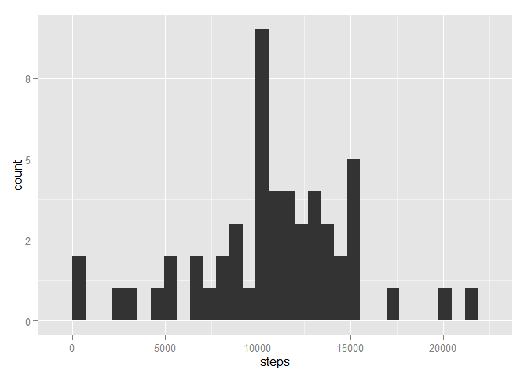
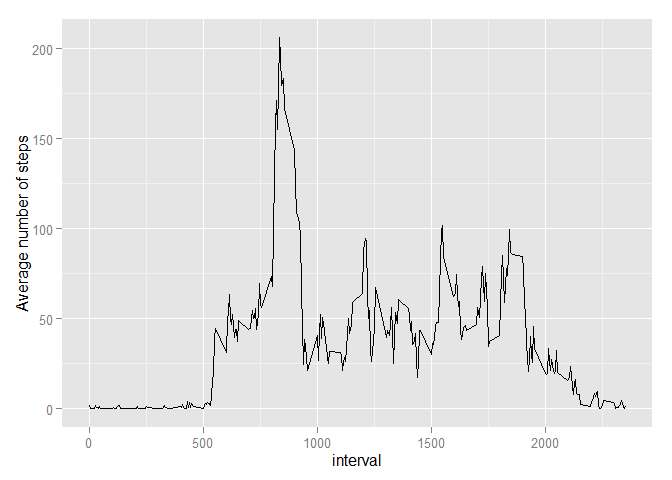
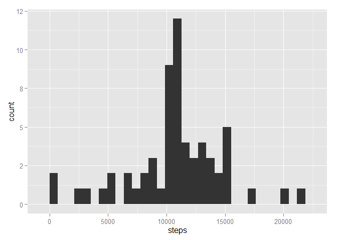
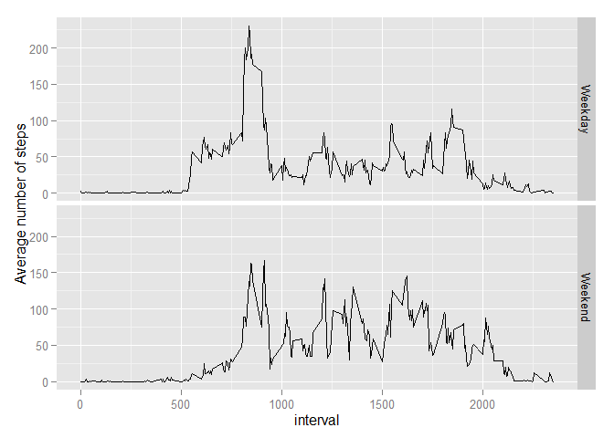

# Reproducible Research: Peer Assessment 1


## Loading and preprocessing the data

```r
library(lubridate)
library(ggplot2)
library(dplyr)
library(timeDate)
options(scipen = 5, digits = 0) #set number display options for knitr.

#Unpack and load activity.zip
if(file.exists("activity.csv") == F) {unzip("activity.zip")}
indata <- read.csv("activity.csv", header =T, sep=",")
indata$date <- ymd(indata$date)
```
## What is mean total number of steps taken per day?

```r
totals <- indata %>% filter(complete.cases(.)) %>% group_by(date) %>% 
    mutate(interval = NULL) %>% summarise_each(funs(sum))
ggplot(data = totals) + geom_histogram(aes(x=steps))
```

 

```r
steps_mean <- mean(totals$steps)
steps_median <- median(totals$steps)
```

Mean number of steps taken each day is 10766 and median is 10765.


## What is the average daily activity pattern?

```r
totals <- indata %>% filter(complete.cases(.)) %>% group_by(interval) %>% 
   summarise(IntervalAverage=mean(steps))
ggplot(data = totals) + geom_line(aes(x=interval, y=IntervalAverage)) +
    ylab("Average number of steps")
```

 

```r
interval_max <- totals[which.max(totals$IntervalAverage),1]
```

Maximum number of steps taken on average across all days contains interval 835.

## Imputing missing values
Calculate interval average across all days and substitute missing values.

```r
na_number <- sum(is.na(indata$steps))
#Calculate average for each interval
int_avg <- indata %>% group_by(interval) %>% 
    summarise(IntervalAverage=mean(steps, na.rm=T))

#Replace missing values in dataset
na_replace <- indata %>% mutate(steps = ifelse(is.na(steps), int_avg$IntervalAverage[match(interval, int_avg$interval)], steps) )

#Make histogram
totals <- na_replace %>% group_by(date) %>% mutate(interval = NULL) %>% summarise_each(funs(sum))
ggplot(data = totals) + geom_histogram(aes(x=steps))
```

 

```r
steps_mean_adj <- mean(totals$steps)
steps_median_adj <- median(totals$steps)
```
Dataset contains 2304 missing values and that is 13% of the whole dataset. After filling in missing data, mean number of steps taken each day is still 10766 and median is now 10766.

## Are there differences in activity patterns between weekdays and weekends?

```r
totals <- na_replace %>% mutate(weekend = isWeekend(date)) %>%
    group_by(weekend, interval) %>% summarise(IntervalAverage=mean(steps))
totals$weekend[totals$weekend==T] <- "Weekend"
totals$weekend[totals$weekend==F] <- "Weekday"
ggplot(data = totals) + geom_line(aes(x=interval, y=IntervalAverage)) +
    facet_grid(weekend ~ .) + ylab("Average number of steps")
```

 
